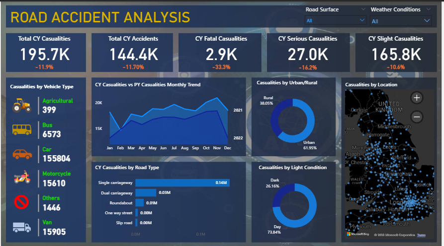

# Road Accident Analysis Dashboard

An interactive Power BI dashboard designed to analyze and visualize road accident data. This project provides insights into accident trends, severity, and environmental factors to help identify high-risk areas.

---

## Dashboard Preview

---

## Project Objectives

Identifying road accident trends and patterns is crucial for safety improvements. This dashboard aims to:
- Track KPIs like Total Accidents, Fatalities, and Casualties.
- Analyze seasonal and yearly trends in accidents.
- Breakdown accidents by vehicle types and severity levels.
- Understand the impact of weather and road conditions.

## Key Features

### Accident Trends
Visualizes the frequency of accidents over different time periods to identify peaks and patterns.

### Severity Analysis
Categorizes accidents into Fatal, Serious, and Slight to prioritize safety interventions.

### Environmental Factors
Explores how light conditions, weather, and road surfaces contribute to accident rates.

### Vehicle Demographics
Provides insights into the types of vehicles most frequently involved in incidents.

## Tools and Technologies

- Power BI Desktop
- DAX (Data Analysis Expressions)
- Power Query

## Project Structure

- `ROAD_ACCIDENTS_ANALYSIS_DASHBOARD.pbix`: Main Power BI report file.
- `assets/`: Contains all visual assets, including the dashboard screenshot and background images.
- `assets/Vehicel Images/`: Images used for vehicle categories within the dashboard.

## Installation and View

1. Clone or download this repository.
2. Ensure you have [Power BI Desktop](https://powerbi.microsoft.com/desktop/) installed.
3. Open `ROAD_ACCIDENTS_ANALYSIS_DASHBOARD.pbix`.

---

