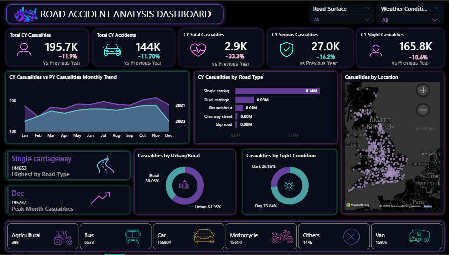
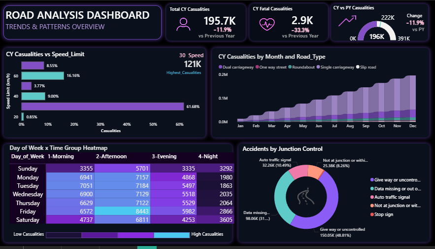
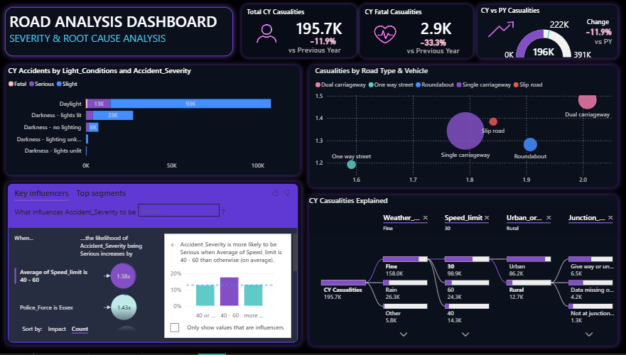

# Road Accident Analysis Dashboard

An interactive Power BI dashboard designed to analyze and visualize road accident data. This project provides insights into accident trends, severity, and environmental factors to help identify high-risk areas.

---

## Dashboard Previews

  
<b>🚀 Overview</b>

   
  

  
<b>📊 Trends & Patterns Overview</b>

   
  

  
<b>🔍 Severity & Root Cause Analysis</b>

   
  

 

---

## Project Objectives

Identifying road accident trends and patterns is crucial for safety improvements. This dashboard aims to:
- **Track KPIs**: Analyze Total Accidents, Fatalities, and Casualties.
- **Accident Trends**: Identify seasonal and yearly trends.
- **Severity Breakdown**: Categorize accidents by severity levels and vehicle types.
- **Root Cause Analysis**: Understand the impact of weather, road conditions, and lighting.

## Dashboard Breakdown

### **1. Overview**
- High-level KPI tracking (Total Accidents, Casualties).
- Geographic distribution of accidents.
- Primary metrics at a glance.

### **2. Trends & Patterns Overview**
- Time-series analysis (Monthly/Yearly trends).
- Identifying peak accident periods.
- Correlation between environmental factors and accident frequency.

### **3. Severity & Root Cause Analysis**
- Deep dive into accident severity (Fatal, Serious, Slight).
- Vehicle type analysis.
- Identifying root causes such as road surface and lighting conditions.

## Tools and Technologies

- Power BI Desktop
- DAX (Data Analysis Expressions)
- Power Query

## Project Structure

- `ROAD_ACCIDENTS_ANALYSIS_DASHBOARD.pbix`: Main Power BI report file.
- `Road Accident Data.xlsx`: The dataset used for analysis.
- `assets/`: Contains dashboard preview images and UI elements.
  
## Installation and View

1. Clone or download this repository.
2. Ensure you have [Power BI Desktop](https://powerbi.microsoft.com/desktop/) installed.
3. Open `ROAD_ACCIDENTS_ANALYSIS_DASHBOARD.pbix`.

---
